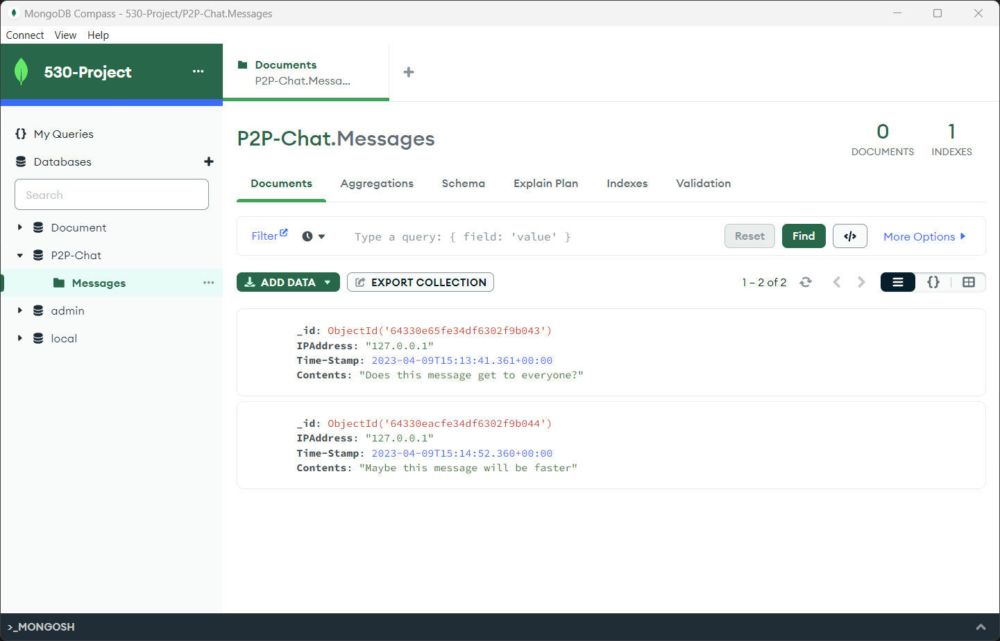

# PeerToPeer-Chat

## Architecture
This peer-to-peer (P2P) chat application consists of two main components: a ChatServer and a ChatClient. The server is responsible for managing connections and broadcasting messages, while the client is responsible for connecting to the server and sending/receiving messages. The application also utilizes a MongoDB database to store messages and their metadata.
### Server
The ChatServer class has the following main methods:
```
__init__(self, host='127.0.0.1', port=55556): Initializes the server, binds it to the specified IP and port, sets up a socket, and initializes a connection to a MongoDB database.
```
```
start(self): Starts the server, listens for incoming connections, and creates a new thread to handle each client connection.
```
```
handle_client(self, conn): Handles incoming messages from clients. It stores the messages in the MongoDB database and broadcasts them to all connected clients except the sender.
```
```
broadcast(self, message, sender_conn): Sends a message to all connected clients except the sender.
```
When executed, the server starts and listens for incoming connections.

### Client
The ChatClient class has the following main methods:
```
__init__(self, host='127.0.0.1', port=55556): Initializes the client, sets the specified IP and port, and creates a socket.
```
```
connect(self): Connects the client to the server and starts a new thread to handle incoming messages from the server. Allows the user to send messages to the server.
```
```
handle_server(self): Handles incoming messages from the server and displays them to the user.
```

When executed, the client connects to the server and allows the user to send and receive messages.

### Database
The data base componet uses mongoDB to store the content of every message along with basic metadata like IP-address, and a timestamp. This occurs within the server and should display an error if a message isn't able to be properly saved. 

